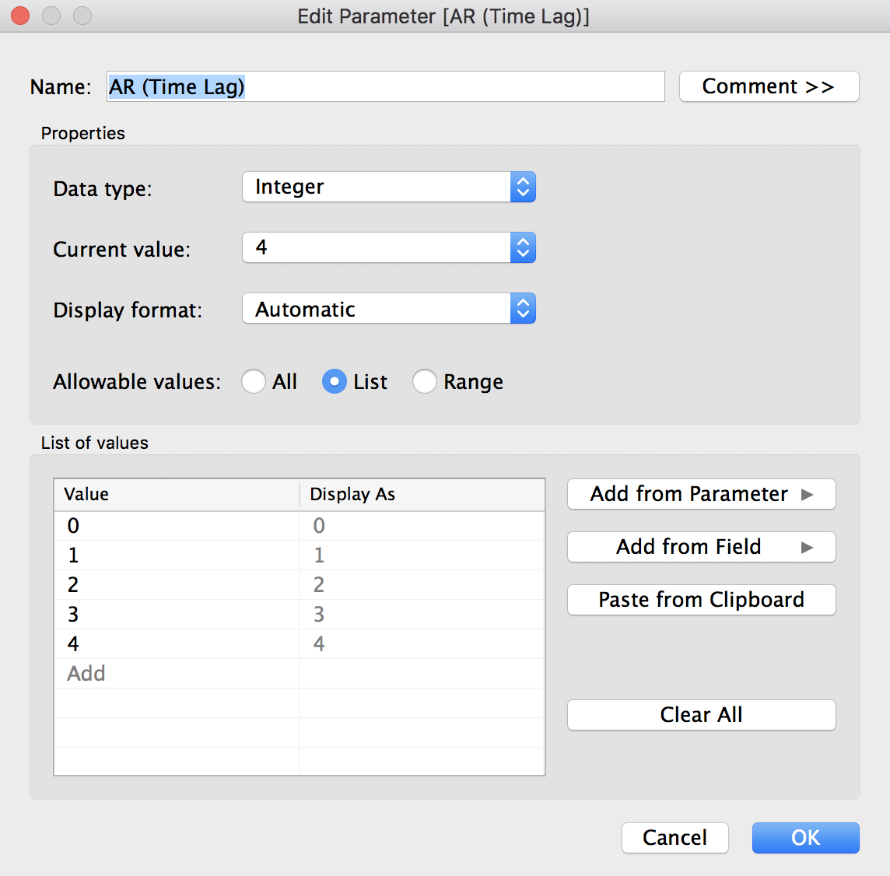
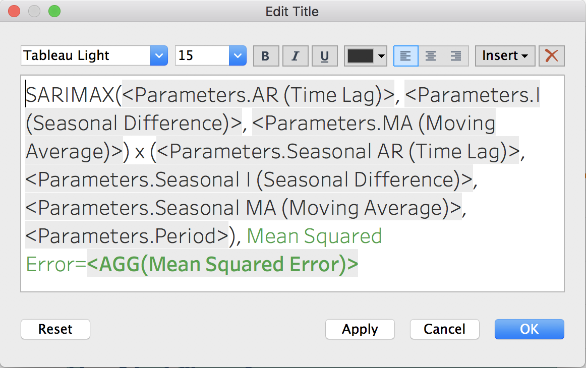

# ARIMA forecasts on the AirPassengers dataset
## Built in Python and Tableau

Raw data can be downloaded [here](https://www.kaggle.com/rakannimer/air-passengers).

Tableau Public dashboard available [here](https://public.tableau.com/profile/greg4084#!/vizhome/sarimaxmodel/SARIMAXdashboard)


This repo demonstrates how I used Python code within Tableau to build an interactive dashboard implementing a time-series forecast. If you just want to play around with the dashboard first and explore the SARIMAX algorithm, download the full python-implemented dashboard [here](sarimax.twbx) or go to this slightly dumbed-down version on [Tableau Public](https://public.tableau.com/profile/greg4084#!/vizhome/sarimaxmodel/SARIMAXdashboard) (Tableau Public wisely but disappointingly disallows external scripts to be uploaded, so I had to fake the Python scripts with hard-coded data sets).


### TabPy: Because when you can’t think of a good name, try a portmanteau

Last year, Tableau released version 10.2 which included integration with Python. It’s not super straightforward how to use it though, so I thought I’d figure it out when a client asked for a time-series forecast dashboard. [ARIMA](https://en.wikipedia.org/wiki/Autoregressive_integrated_moving_average) models are not built into Tableau (Tableau’s [Forecast](https://onlinehelp.tableau.com/current/pro/desktop/en-us/forecast_create.html) module uses [exponential smoothing](https://en.wikipedia.org/wiki/Exponential_smoothing)), and in this particular case I really needed to use the higher predictive capability of the ARIMA algorithm, so [TabPy](https://github.com/tableau/TabPy) seemed to be my only option.

I won’t go into too much detail on how to install TabPy (hint: `pip install tabpy-server`) and no detail at all on how to install Python (I figure, if you want to run Python code inside Tableau, you probably already know how to use Python. If not, [start here](https://www.python.org/about/gettingstarted/).)

Once you have installed the TabPy distribution you will need to navigate to the source code contained in */site-packages* and go subsequently into the tabpy-server directory (in my case, on MacOS with Anaconda 3 installed in the default location, `/anaconda3/lib/python3.7/site-packages/tabpy_server`). From there run `sh startup.sh` or `python tabpy.py` to start up a server. You need to instruct Tableau to constantly sniff port 9004, which is how Tableau and Python communicate. To do this, from within Tableau,

Go to Help --> Settings and Performance --> Manage External Service Connection…
Enter the Server (localhost if running TabPy on the same computer) and the Port (default is 9004).


If you’ve had any trouble so far, try [this tutorial](https://community.tableau.com/message/618129#618129).

### ARIMA: If your portmanteau sounds clunky, go with an acronym
ARIMA stands for **A**uto-**R**egressive **I**ntegrated **M**oving **A**verage. In this tutorial, I’m using its more advanced sibling, SARIMAX (**S**easonal **A**uto-**R**egressive **I**ntegrated **M**oving **A**verage with e**X**ogenous regressors). OK, so what is that?

Let’s start with [Regression](https://en.wikipedia.org/wiki/Regression_analysis). You know what that is, right? Basically, given a set of points, it calculates the line which will best explain the pattern.

Next up is an ARMA model (Auto-Regressive Moving Average). The auto-regressive part means that it’s a regression model which predicts upcoming values based upon previous values. It’s similar to saying that it will be warm tomorrow because it’s been warm the previous three days. (Side note: This is why time-series models are so much more complicated than standard regression. The data points are not independent from each other!). The moving average part is not actually a moving average at all (don’t ask me why, I have no idea). It simply means that the regression error can be modeled as a linear combination of errors.

If an ARMA model doesn’t quite fit your data, you might next try ARIMA. The additional I stands for Integrated. This term accounts for differences between previous values. Intuitively, this means that tomorrow is likely to be the same temperature as today because the past week hasn’t varied too much.

Finally, we move on to SARIMAX. The S stands for Seasonal — it helps to model recurring patterns. These seasonal patterns don’t necessarily have to occur annually per se; for instance, if we were modeling metro traffic in a busy urban area, the patterns would repeat on a weekly scale. And the X is for eXogenous (Sorry. I didn’t come up with this). This term allows for external variables to be added to the model, such as weather forecasts (my model in this tutorial doesn’t add any exogenous variables though).

A [SARIMAX](https://www.statsmodels.org/dev/generated/statsmodels.tsa.statespace.sarimax.SARIMAX.html) model takes the form of SARIMAX(p, d, q) x (P, D, Q)m, where p is the AR term, d is the I term, and q is the MA term. The capital P, D, and Q are the same terms but related to the seasonal component. The lowercase m is the number of seasonal periods before the pattern repeats (so, if you’re working with monthly data, like in this tutorial, m will be 12). When implemented, these parameters will all be integers, and smaller numbers are usually better (ie, less complex). For my model, the parameters I’ve chosen which best fit the model are SARIMAX(2, 1, 2) x (0, 2, 2)12.

I performed a grid search to arrive at these terms. The error I sought to minimize is the [Akaike information criterion](https://en.wikipedia.org/wiki/Akaike_information_criterion) (AIC). The AIC is a measure of how well the model fits the data, while penalizing complexity. In the Tableau dashboards, I report Mean Squared Error because that is much more intuitive.

With that out of the way, let’s take a look at implementing this in Tableau!

### Air Passengers data
If you want to follow along, you can download the [packaged Tableau workbook](sarimax.twbx) right here on my github. I’m using the Air Passengers dataset (https://www.kaggle.com/rakannimer/air-passengers) which contains monthly data on the number of airline passengers from 1949–1961. Take a look at this [Jupyter notebook](sarimax.ipynb) to see what’s going on with this dataset.

### Tableau
I wanted my dashboard to be fully interactive, so I could change all the p’s, d’s, and q’s while observing their effect on the model. So first (and by ‘first’, I mean ‘second, after you’ve connected to the Air Passengers dataset linked to above’), let’s create parameters for these variables.


You will need to create 8 parameters: *AR (Time Lag)*, *I (Seasonality)*, *MA (Moving Average)*, *Months Forecast*, *Period*, *Seasonal AR (Time Lag)*, *Seasonal I (Seasonality)*, and *Seasonality MA (Moving Average)*. Make sure all data types are Integer, or else Python will throw some errors later (and TabPy very unhelpfully declines to provide you with a line number for errors). For *Months Forecast* and *Period*, I used a Range for Allowable values, from 1 to 48 (for *Months Forecast*) and 1 to 24 (for *Period*). We’ll next need to create a calculated field called *Forecast date* so that Tableau will extend the x-axis to include forecasted values. In the calculated field, input:
```
DATE(DATETRUNC('month', DATEADD('month', [Months Forecast], [Month])))
```
We’ll also create a Number of Passengers calculated field to ensure that our SARIMAX data lines up with actual data:
```
LOOKUP(SUM([#Passengers]), [Months Forecast])
```
Finally, one more calculated field called Past vs Future which we’ll use later to format the forecast as a different color:
```
IF LAST() < [Months Forecast]
THEN 'Model Forecast'
ELSE 'Model Prediction'
END
```
### Python
OK, finally! On to the Python. Let’s create our first script. Create a calculated field and name it Forecast. In the field, paste the following code:

```python
SCRIPT_REAL(
'
import warnings
import itertools
import pandas as pd
import numpy as np
import statsmodels.api as sm

dates = _arg1
passengers = _arg2
order_ar = min(_arg3)
order_i = min(_arg4)
order_ma = min(_arg5)
months_forecast = min(_arg6)
seasonal_ar = min(_arg7)
seasonal_i = min(_arg8)
seasonal_ma = min(_arg9)
period = min(_arg10)

y = pd.Series(data=passengers, index=dates)

mod = sm.tsa.statespace.SARIMAX(y,
                                order=(order_ar, order_i, order_ma),
                                seasonal_order=(seasonal_ar, seasonal_i, seasonal_ma, period),
                                enforce_stationarity=False,
                                enforce_invertibility=False)

results = mod.fit()

pred_uc = results.get_forecast(steps=months_forecast)

pred = results.get_prediction(start=(pd.to_datetime("1949-01-01")) + pd.DateOffset(months=months_forecast), dynamic=False)

data = list(pred.predicted_mean)
data.extend(pred_uc.predicted_mean)

return data
',
ATTR([Month]),
ATTR([#Passengers]),
MIN([AR (Time Lag)]),
MIN([I (Seasonal Difference)]),
MIN([MA (Moving Average)]),
MIN([Months Forecast]),
MIN([Seasonal AR (Time Lag)]),
MIN([Seasonal I (Seasonal Difference)]),
MIN([Seasonal MA (Moving Average)]),
MIN([Period]))
```

We’ll also create a calculated field called Mean Squared Error, so that we can have a fancy-pants dynamic title on our chart:

```python
SCRIPT_REAL(
'
import warnings
import itertools
import pandas as pd
import numpy as np
import statsmodels.api as sm

dates = _arg1
passengers = _arg2
order_ar = min(_arg3)
order_i = min(_arg4)
order_ma = min(_arg5)
months_forecast = min(_arg6)
seasonal_ar = min(_arg7)
seasonal_i = min(_arg8)
seasonal_ma = min(_arg9)
period = min(_arg10)

y = pd.Series(data=passengers, index=dates)

mod = sm.tsa.statespace.SARIMAX(y,
                                order=(order_ar, order_i, order_ma),
                                seasonal_order=(seasonal_ar, seasonal_i, seasonal_ma, period),
                                enforce_stationarity=False,
                                enforce_invertibility=False)

results = mod.fit()

pred = results.get_prediction(start=pd.to_datetime("1951-01-01"), dynamic=False)

# Extract the predicted and true values of our time series
y_forecasted = pred.predicted_mean
y_truth = y["1958-01-01":]

# Compute the mean square error
mse = ((y_forecasted - y_truth) ** 2).mean()

return mse
',
ATTR([Month]),
ATTR([#Passengers]),
MIN([AR (Time Lag)]),
MIN([I (Seasonal Difference)]),
MIN([MA (Moving Average)]),
MIN([Months Forecast]),
MIN([Seasonal AR (Time Lag)]),
MIN([Seasonal I (Seasonal Difference)]),
MIN([Seasonal MA (Moving Average)]),
MIN([Period]))
```

Now, drag *Forecast date* to the columns shelf, and *Number of Passengers* and *Forecast* to the rows shelf. Make it a dual-axis chart and synchronize the axes. Put *Past vs Future* on the color mark of the *Forecast* card and you’re done! That was easy, wasn’t it? (Nope, it actually wasn’t. It took me an embarrassingly long amount of time to figure out how to make those scripts work and Tableau’s supremely unhelpful habit of not showing where errors are occurring makes trouble-shooting an exercise in frustration). To spice things up a bit, add those parameters to the side bar so you can change them interactively. Oh! And I almost forgot about that snazzy title. Right click on the title and type in this code:



This is what the final dashboard should look like:
x(0,2,2,12).png)
You’ll have some formatting tasks to take care of if you want it to look identical to mine, or alternately you could just download my dashboard [here](https://github.com/raffg/air-passengers-arima/blob/master/sarimax.twbx) and be done with it. Tableau Public won’t allow any external scripts to be uploaded so sadly that means I can’t share this exact version as shown below. Instead, I just ran through a couple hundred permutations of the SARIMAX parameters and saved each forecast to a csv, and that version, though not as pretty or as programmatically cool, can be toyed with directly on Tableau Public [here](https://public.tableau.com/profile/greg4084#!/vizhome/sarimaxmodel/SARIMAXdashboard).


As you can see, the model is pretty good! That’s the power of SARIMAX: it accurately models the general increasing trend over time, the up-and-down of the seasons throughout the year, and even the increasing variance of data (the increasing distance between the highs of the peaks and the lows of the troughs) as time goes by. You do need to be careful picking your parameters, some pretty interesting stuff can happen if you’re not. My worst performing model for instance, is this (look at that error magnitude!):

x(4,0,3,12).png)
